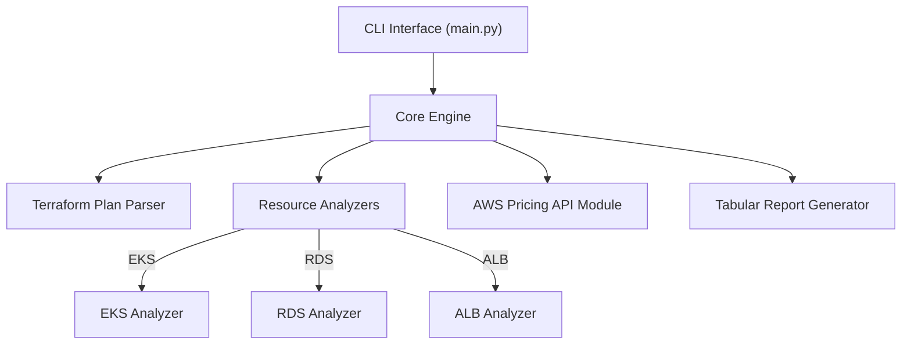

## System Architecture

## Key design principles
- Modularity: Each AWS service is handled in its own module
- Extensibility: Adding new resource support requires minimal integration
- Observability: Debug logs and verbose output options built in

## Patterns used
- Strategy Pattern: Each resource analyzer implements a common interface
- Adapter Pattern: For interaction with AWS Pricing API

## Component relationships
- `main.py` calls the Core Engine
- Core Engine delegates to parsers, analyzers, and output formatters
- Resource modules operate independently and register themselves dynamically